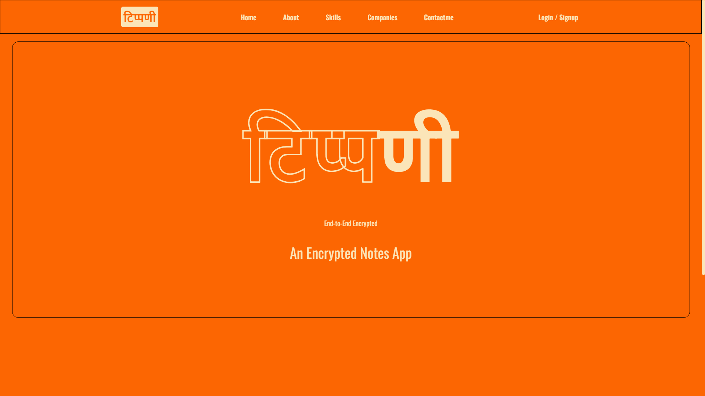
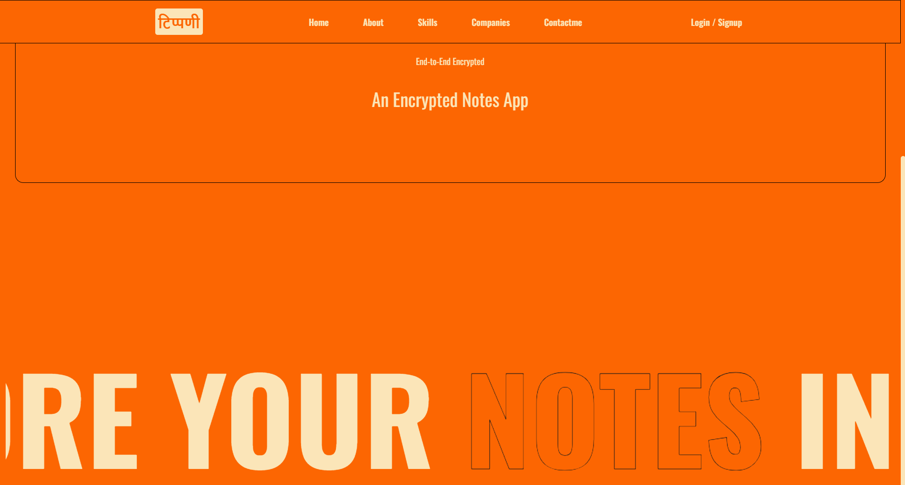
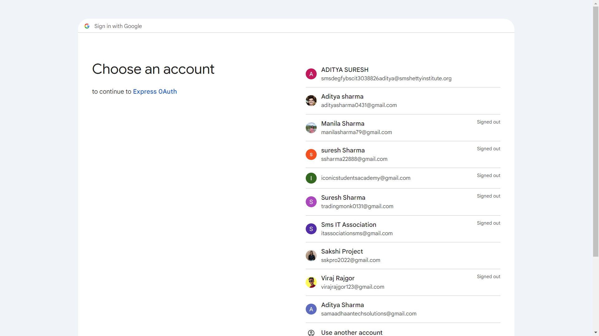
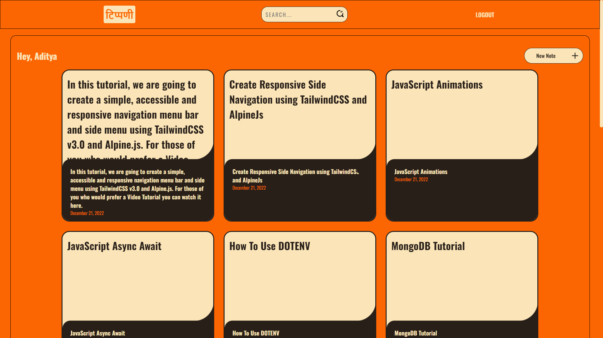
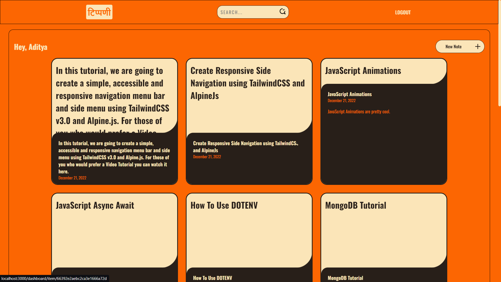
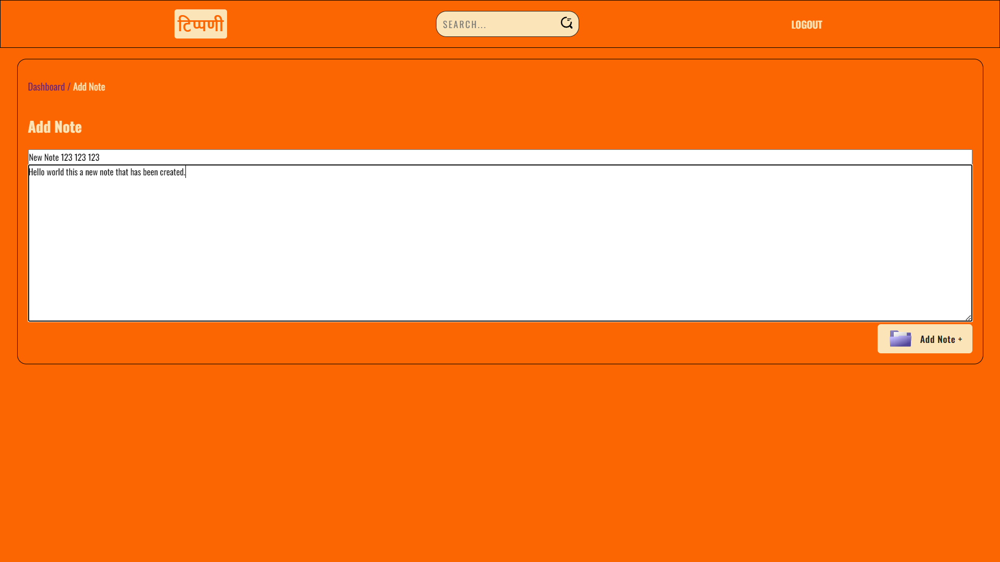
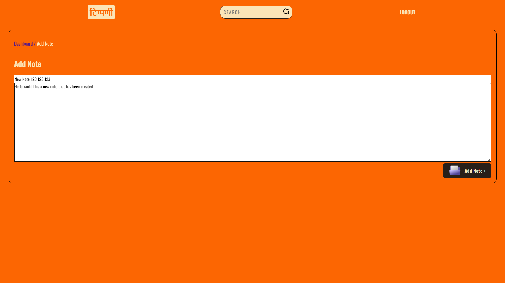
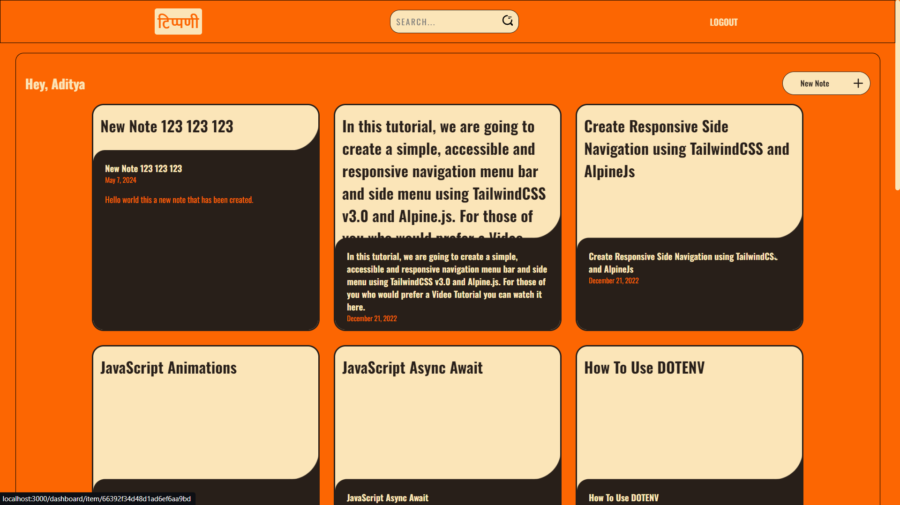
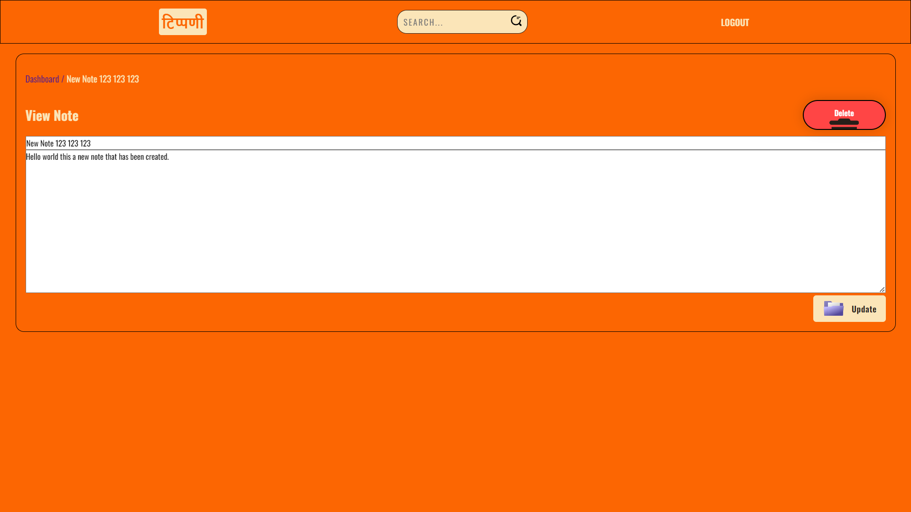
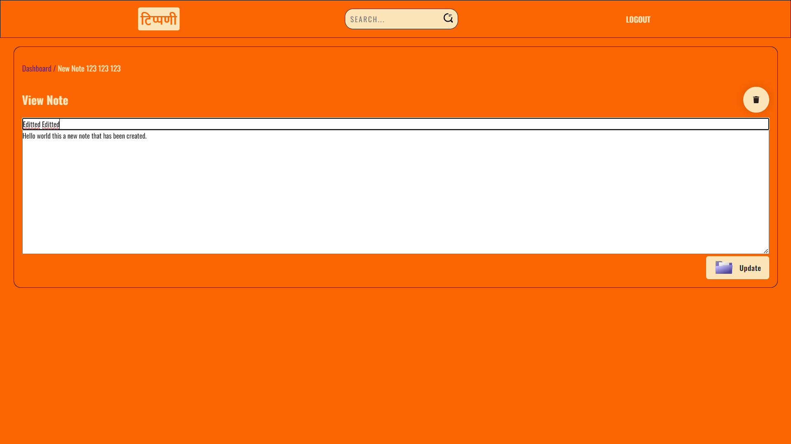

<h1 align="center" id="title">टिप्पणी - Notes App</h1>

This project is basically build in the motive to store users text data in an encrypted format so that the user can rely on the application safely 

<h2>Project Screenshots:</h2>

 

 
 

 

 

 

 

 

 

 

 

 
  
  

Here're some of the project's best features:

- Login page using Google OAuth
- Notes CRUD Operation
- Data stored in encrypted format

<h2>💻 Built with</h2>

Technologies used in the project:

  
  
  
  
  
  
  
  
  
  
  
  
  
  
  
  
  
  
  
  
  
  
  
  
  

<h2>🛡️Contact</h2>

Feel free to contact me through my LinkedIn 

  

